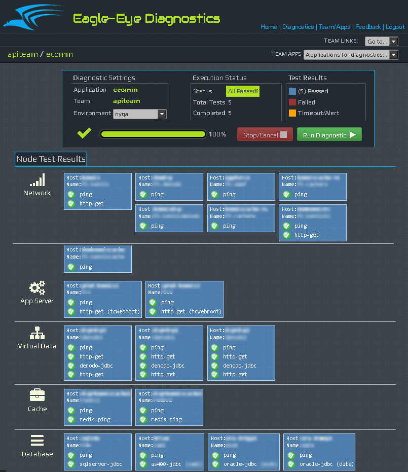

eagle-eye
=========
A web-based diagnostics console for configuring lightweight tests on nodes and arbitrary application services. Health and availability info is displayed in real-time as it becomes avialable upon executing a test battery.

#### Agentless Monitors
Eagle-eye is 100% agentless. Use the console to configure lightweight tests for pretty much anything with a heartbeat: virtual nodes, web/app servers, databases, web services, even linux processes and file system resources.
#####Supported Tests
- Ping (native)   
- Http Get        
- Http Put        
- Redis ping      
- Mongo ping      
- RDBMS connect   
- Process Stat    
- File System (check files, folder, mounts)


## Diagnostics Web Console

#### Control Panel
Displays controls for selecting operational zones; test result metrics reported in real-time:
<p>

<p>

#### Graphical Reporting
Test results generated dynamically and reflect health of node and individual tests for quickly identifying problems:
<p>

<p>

#### Interactive Results
Drill into node-level test results for detailed reporting, run node tests
<p>

<p>


#### Custom Tests
Need a custom test? Extend the framework and implement your own:
```groovy
class MyTest extends AbstractDiagnostic {

   TestResult runDiagnostic(nodeConfig, testConfig, options) {
      attemptDiagnostic(options) { ->
         def result
         try{                     
            //check some service, database, etc
            result = new TestResultPassed("Looking good!")
            
         }catch(Exception e){
            log.error(e.getMessage(), e)
            result = new TestResultFailed(e.getMessage())            
         }
         return result
      }
   }
}
```
